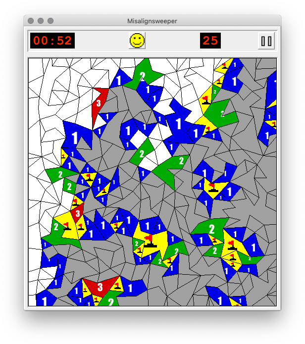

# Misalignsweeper

A simple single-player puzzle game written in standard Java.

## Setup

#### Requirements

This project only uses Java (SE 8+) and the standard library (including Swing), so no need for any building or installing of third-party software. This project is also cross-platform and runs on any operating system.

#### Installation & Use

Simply download and run the standalone .jar file for this project! The project may also easily be built from source, if desired.

## Playing the Game

#### Overview

The objective of the game is to clear a board of randomly generated polygonal tiles, some of which contain mines. Clicking a tile uncovers it, revealing the number of directly adjacent tiles containing mines. The game is won by uncovering every tile not containing a mine. Though not required, it is also possible to use flags to mark potentially mined tiles, which decreases the mine counter in the top right of the display. Flagging/unflagging a tile is done by right-clicking.

#### Settings

To change the game's difficulty or play style, various parameters about the board's generation can be manipulated from the pause menu. The visual theme of the window can also be changed.

## Contributions

#### Suggestions

This project is still very much in development! Anyone testing the code and reporting bugs or suggesting enhancements in the issue tracker is very welcome.

## License

This software is distributed under the terms of the GNU General Public License. Please see the [license](LICENSE.txt) for more details.
